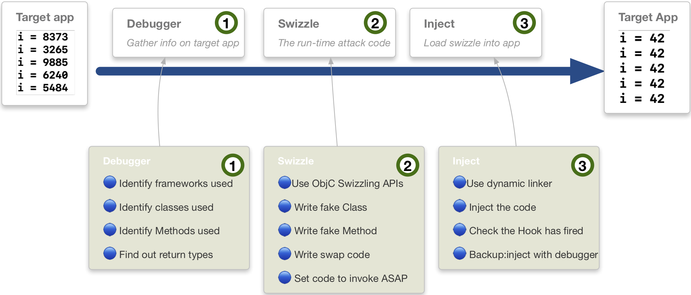
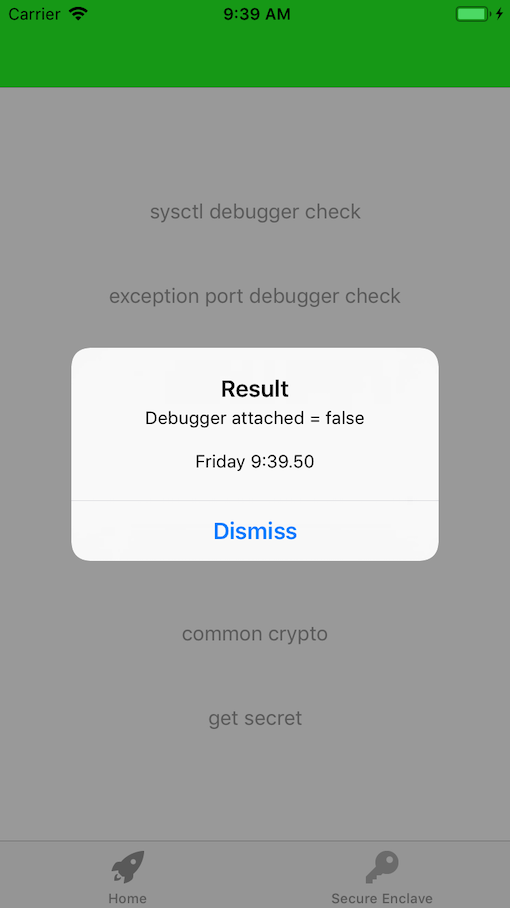
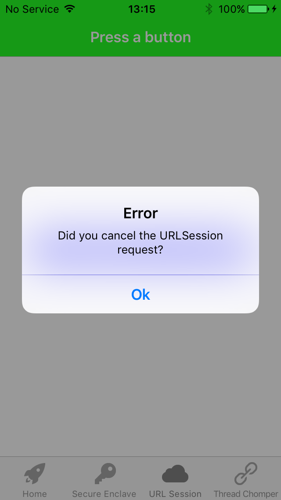
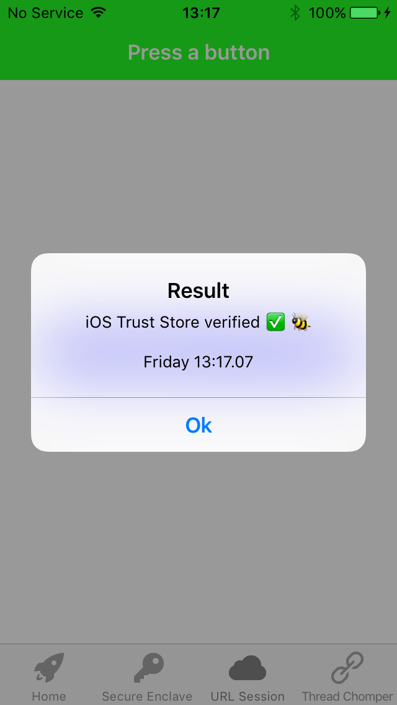

Certificate# iOS Debugger Challenge
This iOS app was written to practice the following techniques:

<!-- TOC -->

- [iOS Debugger Challenge](#ios-debugger-challenge)
  - [Challenge: Method Swizzling on non-jailbroken device](#challenge-method-swizzling-on-non-jailbroken-device)
    - [Step 1: Use a debugger to find information](#step-1-use-a-debugger-to-find-information)
    - [Step 2: Write Swizzle code](#step-2-write-swizzle-code)
    - [Step 3: Place the Swizzle](#step-3-place-the-swizzle)
    - [COMPLETE ON IOS SIMULATOR](#complete-on-ios-simulator)
    - [Repackage app](#repackage-app)
      - [My approach](#my-approach)
        - [Hiccup: OpTool](#hiccup-optool)
        - [Hiccup: Load Command](#hiccup-load-command)
        - [Hiccup: Code signatures](#hiccup-code-signatures)
        - [Hiccup: Entitlements](#hiccup-entitlements)
      - [Hiccup 4: White screen of death](#hiccup-4-white-screen-of-death)
    - [COMPLETE](#complete)
  - [Challenge: Bypass anti-debug (ptrace)](#challenge-bypass-anti-debug-ptrace)
    - [Use dtrace to observe the ptrace call](#use-dtrace-to-observe-the-ptrace-call)
    - [Bypass steps](#bypass-steps)
    - [COMPLETE](#complete-1)
  - [Challenge: Bypass anti-debug (sysctl)](#challenge-bypass-anti-debug-sysctl)
    - [Create an empty Swift framework](#create-an-empty-swift-framework)
    - [Write your fake sysctl API](#write-your-fake-sysctl-api)
    - [Use LLDB to load your hooking framework](#use-lldb-to-load-your-hooking-framework)
    - [Load dylib from Mac into device](#load-dylib-from-mac-into-device)
    - [dlopen and dlsym](#dlopen-and-dlsym)
    - [Find the load addresses for C API sysctl() in the symbol table](#find-the-load-addresses-for-c-api-sysctl-in-the-symbol-table)
    - [Challenge - failed on first attempt....](#challenge---failed-on-first-attempt)
      - [Symbol table to the rescue](#symbol-table-to-the-rescue)
      - [Verify what you found, the easy way](#verify-what-you-found-the-easy-way)
      - [Set a breakpoint](#set-a-breakpoint)
      - [Whoop whoop](#whoop-whoop)
      - [Change load address of API call](#change-load-address-of-api-call)
    - [COMPLETE](#complete-2)
      - [Bonus - use lldb to print when inside your fake sysctl API](#bonus---use-lldb-to-print-when-inside-your-fake-sysctl-api)
  - [Challenge: Bypass anti-debug (Exception Ports)](#challenge-bypass-anti-debug-exception-ports)
    - [COMPLETE](#complete-3)
    - [Useful references](#useful-references)
  - [Challenge: Hook Apple's Random String function](#challenge-hook-apples-random-string-function)
    - [Use lldb to find the API](#use-lldb-to-find-the-api)
    - [Failed on first attempt....](#failed-on-first-attempt)
    - [failed on 2nd, 3rd, 4th, n attempts](#failed-on-2nd-3rd-4th-n-attempts)
    - [FAILED](#failed)
  - [Challenge: Find Encryption key](#challenge-find-encryption-key)
    - [Leveraging Frida-Trace](#leveraging-frida-trace)
    - [Watch the encryption key with a Frida-Script](#watch-the-encryption-key-with-a-frida-script)
    - [Where is the plaintext about to be encrypted?](#where-is-the-plaintext-about-to-be-encrypted)
    - [What is the decrypted plaintext?](#what-is-the-decrypted-plaintext)
    - [Failed to get raw key](#failed-to-get-raw-key)
    - [COMPLETE](#complete-4)
    - [Useful references](#useful-references-1)
  - [Challenge: Dancing with Threads](#challenge-dancing-with-threads)
    - [Attempt 1 - NSThread sleepForTimeInterval](#attempt-1---nsthread-sleepfortimeinterval)
    - [Bypass steps](#bypass-steps-1)
    - [COMPLETE](#complete-5)
      - [Attempt 2 - A trick on Release apps](#attempt-2---a-trick-on-release-apps)
  - [Challenge: Certificate Pinning bypass (NSURLSession)](#challenge-certificate-pinning-bypass-nsurlsession)
    - [Attempt 1 - Frida bypass for iOS Truststore pinning](#attempt-1---frida-bypass-for-ios-truststore-pinning)
    - [Attempt 2 - Swizzle NSURLSession Delegate Method](#attempt-2---swizzle-nsurlsession-delegate-method)
    - [COMPLETE](#complete-6)

<!-- /TOC -->
## Challenge: Method Swizzling on non-jailbroken device
Why `Swizzle`? If you understand `swizzling` you understand part of `Objective-C's` beauty. Read this from [Apple][20e2b71f]
:

  [20e2b71f]: https://developer.apple.com/library/archive/documentation/Cocoa/Conceptual/ObjCRuntimeGuide/Introduction/Introduction.html#//apple_ref/doc/uid/TP40008048-CH1-SW1 "apple_article"

> The Objective-C language defers as many decisions as it can from compile time and link time to runtime. Whenever possible, it does things dynamically.

My goal was to `method swizzle`.  I wanted to swap out a real `random` value with a value that I had chosen (`42`), as the below picture describes:



#### Step 1: Use a debugger to find information
```
(lldb) dclass -m YDObjCFramework
Dumping classes
************************************************************
YDHelloClass

(lldb) methods YDHelloClass
<YDHelloClass: 0x10ef63128>:
in YDHelloClass:
	Class Methods:
		+ (void) sayStaticHello; (0x10ef62ec0)
	Instance Methods:
		- (long) getRandomNumber; (0x10ef62e90)
(NSObject ...)

(lldb) exp import YDObjCFramework

(lldb) exp let $a = YDHelloClass()

(lldb) exp $a.getRandomNumber()
(Int) $R4 = 7981
(lldb) exp $a.getRandomNumber()
(Int) $R6 = 1021
(lldb) exp $a.getRandomNumber()
(Int) $R8 = 1614
```

#### Step 2: Write Swizzle code
I needed to write the code that would target the following information:
```
Class = YDHelloClass
Instance Method = getRandomNumber
```
I went back to `xCode` and selected `New\Project\iOS\Framework\Objective-C`.  Using Objective-C `runtime` APIs, I wrote code that would target Alice's SDK.  

```
+ (void)load
{
    Class orignalClass = objc_getClass("YDHelloClass");

    if (orignalClass != nil) {
        NSLog(@"\n[+] 🎣 Found YDHelloClass\n[+] 🎣 Placing hook on getRandomNumber\n");
        Method original, swizzled;
        original = class_getInstanceMethod(orignalClass, @selector(getRandomNumber));
        swizzled = class_getInstanceMethod(self, @selector(fakeRandomNumber));
        if(original != nil && swizzled != nil)
            method_exchangeImplementations(original, swizzled);
    }
}

@end
```
To read the full code, go [here][70b2d1d9].
#### Step 3: Place the Swizzle
**Step 3**, before I did this on a physical iOS device, I wanted to complete it with a simulator.  I used my trusty debugger connected to the app running on an XCode simulator:
```
lldb) process load /Users/.../swizzle_framework.framework/swizzle_framework
[+] 🎣 Found YDHelloClass

  [70b2d1d9]: https://github.com/rustymagnet3000/YDObjCFramework "YDObjCFramework"

Loading "/Users/.../swizzle_framework.framework/swizzle_framework"...ok
Image 0 loaded.
```
### COMPLETE ON IOS SIMULATOR
After applying the `method swizzle` you would always get a `42` value...


### Repackage app
The way to solve this challenge on a real iOS device depended on whether you had a _jailed_ or _jailbroken_ device.  I had a clean, _jailed iOS12_ device.  I chose to **repackage** the _debuggerChallenge.ipa_ file. This involves taking it apart, adding the `dynamic framework` that contained the _Swizzle_ code and putting the app back together.  

For more info on **repackaging apps**  read [here][5e75f6f0].

  [5e75f6f0]: https://github.com/OWASP/owasp-mstg/blob/master/Document/0x06c-Reverse-Engineering-and-Tampering.md "owasp"

#### My approach
- [x] Build and run Debugger Challenge within xCode.
- [x] Copy the `Product` (which is a folder called `DebuggerChallenge.app` from Finder).
- [x] Copy Bob's framework to the _DebuggerChallenge.app/Framework_ folder.
- [x] Insert a _load command_ with _Optool_ to the app's binary.
- [x] Put the DebuggerChallenge.app directory inside a new, empty folder named `Payload`.
- [x] Compress the `Payload` folder to `unsigned.ipa`.
- [x] Use `Applesign` to re-sign everything inside the IPA.
- [x] Use `iOS-deploy` to get the freshly signed app onto the _Jailed_ device.

It all sounded simple.  But I hit roadblocks:
##### Hiccup: OpTool
```
// get a local copy of OpTool
git clone https://github.com/alexzielenski/optool.git
Make initialize optool’s submodules:
cd optool/
git submodule update --init --recursive   // this was the command I missed!
```
##### Hiccup: Load Command
You have to tell the main app binary to load this new framework.
```
optool install -c load -p "@executable_path/Frameworks/YDBobSwizzle.framework/YDBobSwizzle" -t Payload/debugger_challenge.app/debugger_challenge
```
If it worked you would see..
```
Found FAT Header
Found thin header...
Found thin header...
Inserting a LC_LOAD_DYLIB command for architecture: arm
Successfully inserted a LC_LOAD_DYLIB command for arm
Inserting a LC_LOAD_DYLIB command for architecture: arm64
Successfully inserted a LC_LOAD_DYLIB command for arm64
Writing executable to debugger_challenge.app/debugger_challenge...
```
Verify it...
```
jtool -arch arm64 -l Payload/debugger_challenge.app/debugger_challenge
```
##### Hiccup: Code signatures
If you forgot to code sign anything, you could not deploy it the device.
```
applesign -7 -i <DEVELOPER CODE SIGNING ID> -m embedded.mobileprovision unsigned.ipa -o ready.ipa
ios-deploy -b ready.ipa
ios-deploy -b debugger_challenge.app
No code signature found. AMDeviceSecureInstallApplication(0, device, url, options, install_callback, 0)
```
##### Hiccup: Entitlements
```
ios-deploy -b debugger_challenge.app
The executable was signed with invalid entitlements.
```
What had gone wrong, when I code signed the IPA? Check the file the `provisioning file`  you passed to Applesign.

`security cms -D -i embedded.mobileprovision`

Expiry date, device ID were good. Had I chosen the wrong developer Code Signing ID?
```
<key>Entitlements</key>
<key>ExpirationDate</key>
	<date>2019-05-21T11:01:06Z</date>
<key>ProvisionedDevices</key>
	<string>0ec8227a5f623d0f4f6d257438730d79858a977f</string>
<key>TeamName</key>
	<string>Rusty Magnet</string>
<key>TeamIdentifier</key>
		<string>2N3CU4HVH8</string>
```
Let's try again with a new code signing ID!
```
security find-identity -v -p codesigning
applesign -7 -i <NEW DEVELOPER CODE SIGNING ID> -m embedded.mobileprovision debugger_chall_unsigned.ipa -o ready.ipa
```
That worked.  I could install the app on the device.
#### Hiccup 4: White screen of death
Argh.  The app won't open but it generated a crash log [] which you could get from XCode ].
```
Exception Type:  EXC_CRASH (SIGABRT)
Exception Codes: 0x0000000000000000, 0x0000000000000000
Exception Note:  EXC_CORPSE_NOTIFY
Termination Description: DYLD, Library not loaded: @executable_path/YDBobSwizzle.dylib | Referenced from: /var/containers/Bundle/Application/3F9EDE3F-7BCF-4F25-B438-9145FD3A21B7/debugger_challenge.app/debugger_challenge | Reason: image not found
Triggered by Thread:  0
```
I had forgotten to copy the actual framework!  So I had the _Load Command_ but no code to load!

### COMPLETE
Repeat all the above.  FINALLY, it worked! The Swizzle was placed and working on a `jailed` device.


## Challenge: Bypass anti-debug (ptrace)

Using `ptrace` on `iOS` was a commonly discussed technique to stop a debugger attaching to your iOS app.  If you tried to attach a debugger AFTER  a *deny_attach* was issued, you would see something like this...
```
(lldb) process attach --pid 93791
error: attach failed: lost connection
```
If you attached a debugger before ptrace *deny_attach*  was set, you would see a process crash.

##### Use dtrace to observe the ptrace call
The header files for `ptrace` were not easily available on iOS, unlike macOS.  That said, you could still start issue a *deny_attach* on iOS.  
To see this call call on an iOS Simulator, run `DebuggerChallenge` and hit the `ptrace` button, after writing this command:
```
sudo dtrace -qn 'syscall::ptrace:entry { printf("%s(%d, %d, %d, %d) from %s\n", probefunc, arg0, arg1, arg2, arg3, execname); }'
// ptrace(31, 0, 0, 0) from debugger_challen
```
This won't crash your app if you are running the app on the simulator WITHOUT XCode.

##### Bypass steps
Type the following into your debugger:
```
process attach --pid 96441                // attach to process
rb ptrace -s libsystem_kernel.dylib       // set a regex breakpoint for ptrace
continue                                  // continue after breakpoint
dis                                       // look for the syscall

NOTE - a "waitfor" instruction, is my preferred way to start a debugger
`(lldb) process attach --name "my_app" --waitfor`
```
Check where your breakpoint stopped:


Return an integer 0, to sidestep the real `ptrace` result.
```
(lldb) thread return 0
```
### COMPLETE



## Challenge: Bypass anti-debug (sysctl)
Sysctl was the [Apple_recommended_debug_detect][a3a00022] way to check if a debugger was attached to your app.

  [a3a00022]: https://developer.apple.com/library/archive/qa/qa1361/index.html "apple_link"

**The same trick for Challenge 1 (ptrace) worked with sysctl**. But I wanted to be more creative.  I was inspired by https://github.com/DerekSelander/LLDB to create a new, empty Swift framework that loaded a C function API named - you guessed it -`sysctl`.  That was injected into my app's process image list.

##### Create an empty Swift framework
I created an empty Swift project.  I added the following C code.  You don't need a C header file.

##### Write your fake sysctl API
```
int sysctl(int * mib, u_int byte_size, void *info, size_t *size, void *temp, size_t(f)){

    static void *handle;
    static void *real_sysctl;
    static int fake_result = 0;

    static dispatch_once_t onceToken;
    dispatch_once(&onceToken, ^{  // ensure this is only called once & not on every function call
        handle = dlopen("/usr/lib/system/libsystem_c.dylib", RTLD_NOW);
        real_sysctl = dlsym(handle, "sysctl");  // get function pointer
    });

    printf("Real sysctl function: %p\nFake sysctl: %p\n", real_sysctl, sysctl);
    printf("HOOKED SYSCTL");
    return fake_result;
}
```
##### Use LLDB to load your hooking framework
```
(lldb) image list -b rusty_bypass
error: no modules found that match 'rusty_bypass'
```
##### Load dylib from Mac into device
Now load the process...
```
(lldb) process load /Users/PATH_TO_FRAMEWORK/rusty_bypass.framework/rusty_bypass
Loading "/Users/PATH_TO_FRAMEWORK/rusty_bypass.framework/rusty_bypass"...ok
Image 0 loaded.

(lldb) image lookup -s sysctl           // shows a great view of where the API is invoked
```
##### dlopen and dlsym
Find the load address for the `sysctl` function inside the iOS app.

##### Find the load addresses for C API sysctl() in the symbol table
```
(lldb) expression (void*)dlopen("/usr/lib/system/libsystem_c.dylib",0x2)
(void *) $2 = 0x000000010e7086e0
(lldb) expression (void*)dlsym($2,"sysctl")
(void *) $3 = 0x0000000113be7c04
```
Ok, now check my address of my bypass...
```
(lldb) expression (void*)dlopen("/Users/..../rusty_bypass.framework/rusty_bypass",0x2)
(lldb) ) $4 = 0x0000604000133ec0
(lldb) expression (void*)dlsym($4,"sysctl")
(void *) $5 = 0x000000012e292dc0
```
#### Challenge - failed on first attempt....
Now the `rusty_bypass` framework was loaded, I half expected it to work.  No.  the libsystem_kernel `sysctl` was called before my own code.
##### Symbol table to the rescue
```
(lldb) image dump symtab -m libsystem_c.dylib
Now check your Load Address:  0x0000000113be7c04  for `sysctl`
```
##### Verify what you found, the easy way
```
(lldb) image dump symtab -m rusty_bypass`
Now check your Load Address.  `0x000000012e292dc0` for `sysctl`
```
##### Set a breakpoint
```
(lldb) b 0x0000000113be7c04           
(lldb) register read
```
##### Whoop whoop
This was the killer step. The fruits of labor...
```
General Purpose Registers:
       rax = 0x000000000000028e
        .....
        .....
        .....
       rip = 0x0000000113be7c04  libsystem_c.dylib sysctl
```
##### Change load address of API call
```
(lldb) register write rip 0x000000012e292dc0
rip = 0x000000012e292dc0  rusty_bypass`sysctl at hook_debugger_check.c:5
(lldb) continue
```
### COMPLETE

##### Bonus - use lldb to print when inside your fake sysctl API
I wanted to check I was inside of my hooked-sysctl.  I could have added `syslog` statements to achieve the same.  But that missed the point of improving my lldb skills.  Here was a more fun way...
```
(lldb) breakpoint set -p "return" -f hook_debugger_check.c
(lldb) breakpoint modify --auto-continue 1
(lldb) breakpoint command add 1
  script print "hello”
  DONE
(lldb) continue
```
## Challenge: Bypass anti-debug (Exception Ports)
Another anti-debug technique on macOS was to check if a debugger was attached by looking if any of the Ports used by a Debugger returned a valid response.  This relied on the C `task_get_exception_ports` API.  You passed in the Exception Port you wanted - in argument 2 (the RSI register).  

### COMPLETE
Thanks to: https://alexomara.com/blog/defeating-anti-debug-techniques-macos-mach-exception-ports/.  Set the Exception Ports to check to a null value.  
```
(lldb) b task_get_exception_ports
Breakpoint 3: where = libsystem_kernel.dylib`task_get_exception_ports, address = 0x00007fff6a530675
(lldb) c
Process 48185 resuming
(lldb) p $arg2
(unsigned long) $0 = 66
(lldb) reg w rsi 0
(lldb) c
Process 48185 resuming
No debugger detected
```
### Useful references
```
http://web.mit.edu/darwin/src/modules/xnu/osfmk/man/task_get_exception_ports.html
https://zgcoder.net/ramblings/osx-debugger-detection.html
https://github.com/apple/darwin-xnu/blob/master/osfmk/mach/exception_types.h
```

## Challenge: Hook Apple's Random String function
I started with some simple Swift code.  Could I whiten the UUID to a value I predefined?
```
@IBAction func random_string_btn(_ sender: Any) {
    let randomString = NSUUID().uuidString
    present_alert_controller(user_message: "Random string: \(randomString)")
}
```

##### Use lldb to find the API
```
(lldb) image lookup -rn uuidString
<nothing returned >

(lldb) lookup NSUUID -m Foundation
****************************************************
14 hits in: Foundation
****************************************************
-[NSUUID init]
-[NSUUID hash]
+[NSUUID UUID]

```
Although the API was called via Swift, it was an Objective-C Class.I  attached `frida` to learn more.
```
[iPhone::Debug CrackMe]-> ObjC.classes.NSUUID.UUID().toString();
"6C402B55-6AFC-494A-B976-BCA781801A0A"
```
You could invoke the class with lldb:
```
(lldb) po [NSUUID UUID]
<__NSConcreteUUID 0x6000006374a0> 6BC8E049-2EFD-4BAA-B2AB-456E69AC74F8

(lldb) po [NSUUID UUID]
<__NSConcreteUUID 0x60400043fbc0> A41E59A5-C7C6-470F-88ED-48130BD85D1F
```
This was interesting.  Every time you called that `static method` it would add the pointer to the heap.  They were not deallocated.   Perhaps this was a way to ensure a repeated GUID was never given?

A disassemble revealed some interesting elements.
```
(lldb) disassemble -n "+[NSUUID UUID]" -c10
```
If you move to the init call - in the asm code, the 32-byte field was set to zeros.
```
(lldb) po (char*) $rax
<__NSConcreteUUID 0x6040006234a0> 00000000-0000-0000-0000-000000000000
```
##### Failed on first attempt....
It appeared you could not trust the return register.  As it did not match what Swift presented to the user.

##### failed on 2nd, 3rd, 4th, n attempts
```
frida-trace -m "*[NSUUID **]" -U -f funky-chicken.debugger-challenge

Instrumenting 27 functions.
```
The 4 I cared about were as follows:
```
+[NSUUID UUID]:
-[NSUUID init]:
-[NSUUID UUIDString]:
-[__NSConcreteUUID UUIDString]:
```
`Frida-Trace` generated a javascript file template when the above command ran.  I changed the javascript code to:
```
  onLeave: function (log, retval, state) {
     var message = ObjC.Object(retval);
     log("[+][__NSConcreteUUID UUIDString] -->\n\"" + message.toString() + "\"");
  }
```
### FAILED
Something was odd about this API.  It generated multiple UUID's every time you called the API.  But with Frida or lldb I could never find the actual return value going back to the swift code which was simply:
```
let randomString = UUID()
print(randomString.uuidString)
```

## Challenge: Find Encryption key
I added a popular `RNCryptor` wrapper around Apple's CommonCrypto library.  I statically embedded this into the Debugger Challenge instead of adding as a CocoaPod.

The CommonCrypto API `CCCryptorCreate init` was the target.  It was invoked behind this Swift code that called into the `RNCryptor.encrypt` API:

```
    // Encrypt
    let myString = "Ewoks don't wear pyjamas."
    let myData = myString.data(using: String.Encoding.utf8)! as Data  // note, not using NSData
    let password = "AAAAAAAA" // eight 0x41 values in hex
    let ciphertext = RNCryptor.encrypt(data: myData, withPassword: password)
```
##### Leveraging Frida-Trace
```
frida-trace -i "CCCryptorCreate*" -U "Debug CrackMe"
```


Out of the box, this tells you interesting information.

Trace  | RNCryptor Definition  
--|--
op=0x0  |  Encrypt
alg=0x0  |  kCCAlgorithmAES128
options=0x1 |  kCCOptionPKCS7Padding
keyLength=0x20  |  kCCKeySizeAES256 = 32 (0x20 in hex)
key  |  A pointer to the Binary key (Data encoded)
iv  |  A pointer to the Binary I.V. (Data encoded)
cryptorRef  |  Opaque reference to a CCCryptor object

##### Watch the encryption key with a Frida-Script
```
/* Usage:   frida -U "Debug CrackMe" -l cc_hook.js --no-pause */

console.log("[+] script started...")
if (ObjC.available)
{
  if (Process.isDebuggerAttached() == true)
  {
    console.log("[+] Debugger attached, in addition to Frida.");
  }
  var a = Process.arch.toString()
  console.log("[+] Device chip: " + a);

  var f = Module.findExportByName("libcommonCrypto.dylib","CCCryptorCreate");

  if (f){
      console.log("[+] Found common crypto: " + f);
      Interceptor.attach(f, {
          onEnter: function (args) {
              console.log("inside init statement for CCCryptorCreate. Key, IV and algorithm available");
          }
      });
  }
}
else
{
    console.log("[+] Objective-C Runtime not available!");
}
console.log("[+] ...script completed")
```
##### Where is the plaintext about to be encrypted?
If you look at http://www.manpagez.com/man/3/CCCryptorCreate/ this API will lead to the Encryption Key.  But what if I want the actual plaintext that is being encrypted?  You can use lldb to show the lifecycle of the CommonCrypto API calls.  The flow is the same for encrypt and decrypt.  
```
(lldb) rb CCCrypt
```
- [ ] CCCryptorCreate
- [ ] CCCryptorCreateWithMode
- [ ] CCCryptorGetOutputLength
- [ ] CCCryptorUpdate
- [ ] CCCryptorGetOutputLength
- [ ] CCCryptorFinal
- [ ] CCCryptorRelease

The man page tells you the plaintext is sent into this API:
```
CCCryptorUpdate(CCCryptorRef cryptorRef, const void *dataIn,
         size_t dataInLength, void *dataOut, size_t dataOutAvailable,
         size_t *dataOutMoved);
```
Now we have our target - argument 2 - let's use lldb to reveal the plaintext.

RDI - first arg, **RSI - second arg**, RCX - fourth arg


```
lldb) rb CCCryptorUpdate
Breakpoint 1: where = libcommonCrypto.dylib`CCCryptorUpdate, address = 0x000000010b91092c
(lldb) c
Process 11315 resuming

(lldb) register read
General Purpose Registers:
       rsi = 0x000060400044a2a0

Note ->  RSI can be access via $arg2 in lldb
(lldb) po (char*) $arg2
"Ewoks don't wear pyjamas."

(lldb) memory read 0x000060400044a2a0
0x60400044a2a0: 45 77 6f 6b 73 20 64 6f 6e 27 74 20 77 65 61 72  Ewoks don't wear
0x60400044a2b0: 20 70 79 6a 61 6d 61 73 2e 00 00 00 00 00 00 00   pyjamas........
```
##### What is the decrypted plaintext?
```
(lldb) b CCCryptorFinal
(lldb) c
(lldb) po (char*) $arg2
(lldb) po (char*) $rsi
(lldb) mem read 0x00006040000106a0 -c10
```
Sometimes, the decrypted text was not together.  I had an assumption this related to the C `Malloc` API - that was used the hood by CommonCrypto.  `Malloc` was not always given sequential blocks of memory from the O/S.
#### Failed to get raw key
```
(lldb) rb CCCryptorCreateWithMode
Breakpoint 1: where = libcommonCrypto.dylib`CCCryptorCreateWithMode, address = 0x00000001826c8474
(lldb) rb CCCryptorCreateWithMode

API definition from Apple:
CCCryptorCreateWithMode(op, mode, alg, padding, iv, key, keyLength, tweak, tweakLength, numRounds, modeOptions, cryptorRef);

To get the Key Length.....
(lldb) po (size_t) $arg7
32  // 256 bit key

To get the raw key...
(lldb) memory read -s4 -fx -c32 $arg6
<< never get an understandble key, in here. >>
```

### COMPLETE
Using the CCCryptorCreate API spec, we can see which arguments to read.
```
CCCryptorCreate(CCOperation op, CCAlgorithm alg, CCOptions options,
         const void *key, size_t keyLength, const void *iv,
         CCCryptorRef *cryptorRef);
```
With a pre-defined key 16 byte key (128 bits), I can read it with the following debugger commands.
```
(lldb) b CCCryptorCreate
Breakpoint 1: where = libcommonCrypto.dylib`CCCryptorCreate, address = 0x000000010a6d51b7

(lldb) reg read $arg4
     rcx = 0x000060800003a590

(lldb) mem read 0x000060800003a590
0x60800003a590: 41 41 41 41 41 41 41 41 41 41 41 41 41 41 41 41  AAAAAAAAAAAAAAAA

(lldb) memory read -s16 -fC $arg4
0x60800003a590: AAAAAAAAAAAAAAAA

(lldb) memory read -s16 -fx -c1 $arg4
0x60800003a590: 0x41414141414141414141414141414141
```
If you read the Initialization vector, lldb cannot display a lot of the characters.  That is because the code callinto into the API `SecRandomCopyBytes` which gives a lot of extended / non-Ascii characters.  You can still read it by forcing it to print in hex.
```
(lldb) mem read -s1 -fx $arg6
0x6080002668c0: 0x46 0xbc 0x72 0xc9 0x04 0xfb 0xb5 0xd6
```
### Useful references
```
https://richardwarrender.com/2016/04/encrypt-data-using-aes-and-256-bit-keys/
https://stackoverflow.com/questions/25754147/issue-using-cccrypt-commoncrypt-in-swift
```
## Challenge: Dancing with Threads
The idea of this challenge was to manipulate an iOS that used multiple background Threads to achieve a task.  For this, I wanted to re-order the Cars and Airplanes.  


##### Attempt 1 - NSThread sleepForTimeInterval
As there were two background threads - each adding to a single array - I had to set a good breakpoint on a specific thread:
```
 (lldb) exp NSTimeInterval $blockThreadTimer = 0.5;
 (lldb) exp [NSThread sleepForTimeInterval:$blockThreadTimer];
  ```


Something was wrong, with my first attempt.  What happened to the Airplanes?  Well, it was a bug in the code.  The line of code that blocked the main thread from returning from the `Thread Chomper` code only waited for a single background thread.   After adding:
```
dispatch_semaphore_wait(semaphore, DISPATCH_TIME_FOREVER);
```
##### Bypass steps
Breakpoints are better when set to a specific Thread.  Type the following into your debugger:
```
breakpoint set after one of the dispatch_async calls
breakpoint set  --file thread_chomper.m --line 34 thread 5
(lldb) expression
NSTimeInterval $blockThreadTimer = 2;
[NSThread sleepForTimeInterval:$blockThreadTimer];
// ENTER to finish expression
```
### COMPLETE


##### Attempt 2 - A trick on Release apps
I was not satisfied with attempt 1.  It was only available on debug builds, where you could set simple `breakpoints`.  Attempt 2 looked to abuse Apple's `Grand Central Dispatch` _Quality of Service_ level that was set when coding " I want a background thread, please ".
```
dispatch_async(dispatch_get_global_queue(DISPATCH_QUEUE_PRIORITY_DEFAULT, 0), ^{
```
## Challenge: Certificate Pinning bypass (NSURLSession)
The challenge is to get around checks performed when sending a network request with Apple's NSURLSession class and delegates.  All of these defence build up an app's `Certificate Pinning` setup.



If you send traffic via `https` ( the default since iOS 9 ) the `URLSessionDelegate` will invoke the below method:

```
func urlSession(_ session: URLSession, didReceive challenge: URLAuthenticationChallenge, completionHandler: @escaping (URLSession.AuthChallengeDisposition, URLCredential?) -> Void) {
```

This is where the `Cert Pinning` checks are likely to happen.  If an app is `Pinning` against the `iOS Truststore` you would see code like this:

```
guard let trust: SecTrust = challenge.protectionSpace.serverTrust else {
    return
}
var secResult = SecTrustResultType.invalid
var osStatus = SecTrustEvaluate(trust, &secResult)
```
The `iOS Truststore` allows a user to add `Self-Signed Certificates` via the Settings app on iOS.  Hence, hardened iOS app's use their own, smaller list of list of Root and Intermediary Certiciate Authorities. This is called a `pinlist`.

If the app code cannot verify the `Certificate Chain` the `secResult` can be set to negative value.  Afterwards, the app will probably call `completionHandler(.cancelAuthenticationChallenge, nil)` to cancel the attempted TLS connection.

##### Attempt 1 - Frida bypass for iOS Truststore pinning
Using `Frida` I used a script that would write over the `secResult` variable.  This was written to with this call `SecTrustEvaluate(trust, &secResult)`.  I would effectively be changing a `DENY` to a `PROCEED`.

```
const moduleName = 'Security';
const functionName = 'SecTrustEvaluate';
const SecTrustEvaluatePtr = Module.findExportByName(moduleName, functionName);

try {
    if (SecTrustEvaluatePtr == null) {
        throw '[*] %s not found', moduleName, functionName;
    }
    console.log('[*] Script loaded. ' + moduleName + '.' + functionName + '\tpointer: '+ SecTrustEvaluatePtr);

    Interceptor.replace(SecTrustEvaluatePtr,new NativeCallback(function(trust,result) {

        console.log('[*]SecTrustEvaluate called');
        console.log('\tDefault SecTrustResultType: ', Memory.readU32(result));
        Memory.writeU32(result,1);
        console.log('\tnew SecTrustResultType: ', Memory.readU32(result));
        return 0;   // Return errSecSuccess to OSStatus call
    } ,'int',['pointer','pointer']));
}
catch(err){
    console.log('[!] Exception: ' + err.message);
}
```

Success!
```
[*]SecTrustEvaluate called
	Default SecTrustResultType:  3
	new SecTrustResultType:  1
[*]SecTrustEvaluate called
	Default SecTrustResultType:  0
	new SecTrustResultType:  1
```


##### Attempt 2 - Swizzle NSURLSession
The Frida bypass worked well for trivial iOS Truststore pinning. But what happens if the app checked a locally held Public Key against the Public Key it received during the TLS setup negotiation?

I liked this guy's example code:
https://www.bugsee.com/blog/ssl-certificate-pinning-in-mobile-applications/
```
// Public key pinning
let serverPublicKey = SecCertificateCopyPublicKey(serverCertificate)
let serverPublicKeyData:NSData = SecKeyCopyExternalRepresentation(serverPublicKey!, nil )!
let keyHash = sha256(data: serverPublicKeyData as Data)
if (keyHash == pinnedPublicKeyHash) {
    // Success! This is our server
    completionHandler(.useCredential, URLCredential(trust:serverTrust))
    return
}
```
I can use Frida trace to get me so far. I can also statically patch out the code. But the latter is hard and takes a lot of analysis.  How about we just ever call that code and we set the code to only `completionHandler(.cancelAuthenticationChallenge, nil)`?

Well, you can write a `Method Swizzle` to achieve the same.
```
- (void)YDHappyChallenge:(NSURLSession *)session didReceiveChallenge:(NSURLAuthenticationChallenge *)challenge completionHandler:(void (^)(NSURLSessionAuthChallengeDisposition, NSURLCredential *))completionHandler{

    NSLog(@"🍭\t NSURLSession on: %@", [[challenge protectionSpace] host]);
    completionHandler(NSURLSessionAuthChallengePerformDefaultHandling, NULL);
}
```
### COMPLETE
Success!  The swizzle was a lot more effective, given how much scope was given to developers to implement code inside the delegate.


Not all Cert Pinning checks were not bypassed using these methods.
